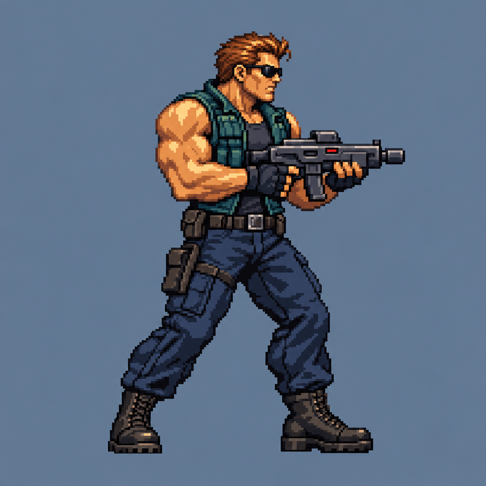

# Jessie / visual direction reference

Generated with the built-in image-generation tool, September 13, 2026. This is
a visual reference for silhouette, torso taper, muscle planes, costume clusters
and weapon proportions. The generated bitmap is not a native sprite sheet and
is not rendered as a gameplay asset. Actual big/mini sprites are independently
drawn on the locked native grids in `jessie.js`.

## Exact prompt

Create a professional pixel-art character design reference for an original run-and-gun game hero named Jessie. Full-body right-facing SIDE VIEW with just a little three-quarter chest, athletic stocky muscular adult man, short copper-brown swept-back hair, black wraparound sunglasses, short stout neck, broad trapezius and deltoids, warm medium tan skin, sleeveless dark teal tactical vest partly open over charcoal shirt, dark navy cargo trousers, leather belt and reinforced practical boots, fingerless gloves. Original 1990s arcade action game pixel craftsmanship, grounded adult proportions, about seven heads tall, character body 96 native pixels tall on a 128x128 native cell, displayed exactly 6x nearest-neighbor enlarged. Clean sculpted pixel clusters, controlled 16-color palette, strong silhouette and economical shading, warm upper-left highlights and cool shadows, no gradients or smoothed pixels. Single figure in a relaxed combat-ready stance holding a compact horizontal sci-fi carbine in both hands at chest height. Gun is modest scale so the anatomy dominates. Weight visibly supported by a bent rear leg and a planted front boot. Torso noticeably broad and muscular, legs substantial and natural, handsome square jaw, readable small nose. Entire figure and gun fully visible centered, feet at consistent baseline, blank solid muted blue-gray background. No lettering, no panel borders, no UI, no labels, no other figures. This is a model reference to improve anatomy, outfit clustering and silhouette in native sprite animation.
