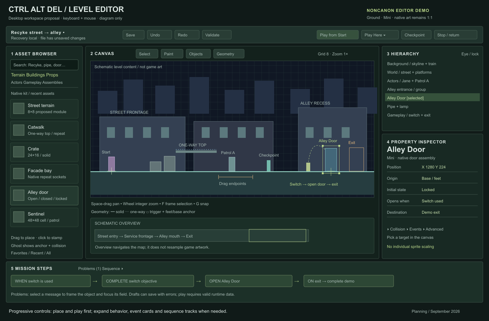

# Ctrl Alt Del — desktop level editor plan

Status: **planning only**. Prepared September 14, 2026 UTC from the local project. No editor, gameplay, character, or asset-library implementation accompanies this plan. PC keyboard and mouse are the target; mobile editing is excluded. Proposed names, dimensions, timings, and milestones below are design proposals unless identified as existing contracts.

## Recommendation

Build a dedicated browser-based desktop editor alongside the existing JavaScript/Canvas game. Use Recyke's pure simulation and native mini renderers as the foundation. First separate scene content from its procedural renderer and hardcoded mission rules; then let the editor and game consume the same validated level document and asset registry. Keep ground and flight simulations separate behind one playtest interface.

The minimum useful release must let a designer start with an empty map, paint a street, place platforms and props, add a player, patrol, checkpoint and objective-controlled door, save, and finish the level using ordinary keyboard controls. A wide feature menu without that complete loop is not a useful first release.

Use a small **Recyke street-to-alley editor demonstration**, explicitly outside campaign canon, as the acceptance map. This is a tooling prerequisite to the Episode I plan's recommended Chapters 1–2 opening, not a replacement campaign chapter. Build the opening with the editor after the scene and dialogue milestone.

Jump to: [inspection](#1-sources-authority-and-inspection-limits) · [workspace](#2-desktop-workspace-and-discoverability) · [workflow](#3-blank-map-to-playable-mission-concrete-workflow) · [pixel/family rules](#4-native-pixels-families-anchors-and-layouts) · [asset kits](#5-asset-library-inventory-and-kit-plan) · [flight](#6-ground-and-cruiser-editing-modes) · [campaign needs](#7-episode-i-requirements-mapped-to-editor-capabilities) · [architecture](#8-architecture-and-saved-data) · [demo](#9-recyke-street-to-alley-demonstration) · [milestones](#10-delivery-milestones-and-acceptance-gates) · [decisions](#11-decisions-that-materially-need-input-later).

## 1. Sources, authority, and inspection limits

Read the [lead designer reference](../story/lead-designer-reference.md), its [verbatim original](../story/lead-designer-original.txt), and the full [Episode I implementation plan](../story/episode-i-implementation-plan.md). Exact supplied dialogue remains in those sources; this plan does not invent missing dialogue or lore.

Applicable instructions inspected: [root](../../AGENTS.md), [Recyke](../../recyke-development/AGENTS.md), [Jane](../../jane-development/AGENTS.md), [Jessie](../../jessie-refinement/AGENTS.md), and [enemies](../../enemy-development/AGENTS.md), plus their character/enemy/art standard files. The [shared mini review](../../mini-review/README.md) records the active visual contracts. The [Recyke art](../../recyke-development/ART-STANDARDS.md), [Jane](../../recyke-development/JANE-STANDARD.md), [Jessie](../../recyke-development/JESSIE-STANDARD.md), and [enemy](../../recyke-development/ENEMY-STANDARD.md) standards defer to those instructions. Equivalent standards in the other development folders were also read.

**Current authority is mini-only, Proposal A.** Older dual-family descriptions in [RECYKE-LEVEL.md](../../recyke-development/RECYKE-LEVEL.md), comments in source, and historical appearance statements in the story reference do not override the active rules. “Janey” in narrative maps to existing `jane`; do not rename APIs. The Episode I document's pending-art status is historical planning context. The user's currently concurrent task is adding crouch for both heroes; this plan neither certifies its completion nor expands its scope.

This was a read-only source/metadata inspection plus inspection of the existing [desktop gameplay capture](../../mini-review/assets/gameplay/recyke-mini-desktop.png). Existing test files were inspected as verification references; gameplay and art tests were not rerun for a documentation change. Live hero/runtime files are changing: crouch states and gameplay logic appeared during inspection while exported animation JSON still described the earlier action sets. Treat this as a moving handoff, not a defect to fix here. Pin an approved source/metadata revision before implementing the editor adapters.

### Actual engine baseline

| Evidence | Existing capability | Consequence for the editor |
| --- | --- | --- |
| [recyke-level.js](../../recyke-development/recyke-level.js), `CADRecykeLevel.create({size, hero, random, level})` | DOM-free simulation; optional supplied level is cloned/frozen. `update`, `snapshot`, `reset`, `setHero`, `setPaused` are available. Active size is forced to mini. | A useful seam already exists. It is not a generic level loader: required config fields, hardcoded rules and array-based IDs still constrain it. |
| Same file, mini config | 480×270 viewport, 2,112-unit route, floor 222; 12 platform rectangles, 8 enemies across 6 archetypes, 7 placed health/scrap pickups, 5 horizontal hint zones, one checkpoint and one exit. | Import this map as a regression fixture later; preserve the current playable route. Do not mistake it for the story opening. |
| Same file, movement/combat | Solid axis-aligned rectangles, one-way tops, coyote time/jump buffering, swept projectile tests against solids, aim assist, melee, enemy telegraph/attack loop. | Expose these exact supported primitives first. Slopes, arbitrary polygons, moving platforms, climb and a general hazard system require engine work. |
| Same file, enemy/update/reset logic | Patrol bounds `left/right` at one support height; drone bobbing; safe-start X threshold and range/line-of-sight targeting. Checkpoint remembers killed/collected indices in memory. | No route graph, general spawn conditions, navigation, stealth mission, multiple checkpoints or persistent mission snapshots. `optional` is authored but does not establish a generic objective policy. |
| Same file, `updateWorld` | Exit reads `data.enemies.find(e => e.gate).dead`; notices, progress and pickup count text assume Sorting Row. | A blank/enemy-free mission can fail. Replace this dependency with explicit completion conditions before advertising blank-map play. |
| [recyke-art.js](../../recyke-development/recyke-art.js) | Native raster drawing, existing hero/enemy adapters and palette. Terrain follows `platforms`; much scenery has fixed positions, floor 222, facade repetition and a hardcoded pass order. Public API is only `draw`, `palette`, `word`. | Extract registered mini drawing primitives and scene layers. Placing a bin in JSON currently cannot move the procedural bin. Blank maps must stop receiving automatic Sorting Row scenery. |
| [recyke.js](../../recyke-development/recyke.js), [recyke.html](../../recyke-development/recyke.html) | Canvas/HUD/input host, pause/retry, focus clearing, pixel fitting; browser globals loaded by script tags. | Extract a reusable host with explicit mount/dispose and scoped input. Do not embed the entire existing page and accumulate global listeners on each playtest. |
| [pixel-grid.js](../../recyke-development/pixel-grid.js) | Integer device-pixel scene scale, DPR-aware alignment, smoothing disabled, overflow instead of shrinking below 1 physical pixel per art pixel. | Reuse for the viewport; editor pan/zoom and pointer conversion must obey the same transform. |
| [hero sheets/metadata](../../recyke-development/assets/jane/jane-animation.json), [Jessie metadata](../../recyke-development/assets/jessie/jessie-animation.json), [enemy adapter](../../recyke-development/enemies.js) | Native mini cells, per-action frame counts/holds/loops; hero/mech contacts and motion metadata; drone ground anchor/hover offset. | Preserve metadata; derive thumbnails and previews from approved adapters. A sheet's padded columns are not additional authored frames. |
| [flight-level.js](../../recyke-development/flight-level.js), [flight-art.js](../../recyke-development/flight-art.js) | Playable side-view flight with movement, shooting, waves, hits, pause and retry. Wave timing and boss ending are hardcoded; DOM, simulation and drawing are mixed. | Reuse behavior concepts by extraction. Add authored route loading, boosts, weapons, snapshots and native mini vehicle presentation. This is a larger adapter than ground. |
| [level-one.js](../../recyke-development/level-one.js), [environment-art.js](../../recyke-development/environment-art.js), [world.js](../../recyke-development/world.js), [chase.js](../../recyke-development/chase.js) | Historical Skyview combat and city/flight studies; legacy renderers, pickup/drop examples, rear-flight visual study. | Composition/logic references, not approved modular mini kits. No playable rear-flight engine or Skyview house interior follows from their existence. |
| [Recyke checks](../../recyke-development/tests/recyke-level.cjs), [art checks](../../recyke-development/tests/recyke-art.cjs), [browser checks](../../recyke-development/tests/recyke-browser.cjs), [flight checks](../../recyke-development/tests/flight-level.cjs) | Simulation, native-pixel and browser-input verification patterns. | Extend meaningful checks around data round trips, editor input, mission state and unchanged gameplay after extraction. Existing tests alone cannot certify the new editor. |

The inspected active folders are related copies of a small JavaScript game, not separate finished engines. No package-based application framework or existing level-editor infrastructure was found in the inspected project. Do not multiply the editor across all four development folders.

## 2. Desktop workspace and discoverability



[Open the standalone workspace diagram](desktop-workspace.svg). It is an annotated wireframe, not approved game art or an implemented interface. Labels show the proposed demonstration, not canon.

Design for a comfortable 1440×900 desktop, with a functional 1280×800 arrangement. A 240px asset browser sits left; the center takes remaining space; a roughly 300px right dock contains hierarchy above properties. Panels resize and collapse. The optional bottom dock contains Problems, Mission Steps, or Sequence, only one open at a time. At smaller windows collapse the left dock before shrinking the game pixels. Remember the user's workspace arrangement separately from level data.

- **Top bar:** document name/dirty indicator, mode (`Ground · Mini`), Save, Undo/Redo, Validate, Play from Start, a Play menu for Here/Checkpoint/Test State, and a visible Stop during play. Menus display their shortcuts. Autosave status says whether recovery is local or a file was saved.
- **Left browser:** permanent search; category chips Terrain, Buildings, Props, Actors, Gameplay, Assemblies; filters for biome, role and available runtime capability. Show native dimensions, collision badge and approval status in the item details. Favorites/Recent remove repetitive searches. Unsupported mechanics appear in a clearly labeled planned-assets catalog, not as apparently playable tools.
- **Center:** a native-pixel scene, rulers, current tool options, and a small schematic overview. A quiet empty canvas says “1 Paint ground · 2 Place a start · 3 Place an exit · Play.” These are clickable tool choices, not a mandatory wizard.
- **Hierarchy:** authored layers and named groups, search, eye and lock controls, player start and mission objects. Selecting a node or canvas object selects the same inspector. A badge identifies a reusable assembly instance; expand it to see children.
- **Inspector:** selection name, asset, native position, facing, and the few common settings first. Behavior, Collision and Events are collapsed sections; an Advanced disclosure reveals validated override fields. Multiple selection shows common fields and “Mixed” values, with one undo step for a batch edit.
- **Bottom:** a nonmodal problems list where selecting an error frames its object and focuses the relevant field. Mission Steps uses readable event/action cards; only open the sequence timeline when staging a scene. Status bar shows coordinates, grid, whole-pixel zoom and contextual mouse help.

Do not open with a node graph, a wall of physics numbers or a raw JSON editor. Make frequent work directly manipulable; offer “Show data” as a read-only troubleshooting view later. Use ordinary readable HTML typography, keyboard focus and labels in the UI; the art inside the scene stays native. Overlay meaning must use line styles/icons and labels as well as color.

## 3. Blank map to playable mission: concrete workflow

### A. Start and block out

Choose New → Ground Mission. Name it and accept `Mini`, 480×270 gameplay viewport and a proposed 1,440×540 world. The larger world height allows later camera staging; M1 implements its world bounds explicitly. A new document starts empty with background color, default layers and the approved ground physics profile. No enemy, checkpoint, floor, story title or “Line 7” ending is silently inserted. Bounds can be expanded from a border handle; shrinking warns about affected objects and never deletes them implicitly.

Click Terrain → Recyke street, then drag a rectangle or brush stroke across the canvas. The ghost shows the occupied cells and collision top. Use a proposed **8×8 terrain module** and an 8-unit placement grid, with 1-unit precision available. This does not change 48×48 character cells or existing 24-unit floor decoration repeats. Existing odd-size primitives stay exact; author any new 8-unit tiling kit natively instead of resizing those primitives.

Paint replaces cells only on the active terrain layer. Erase removes those cells, updates their edges and corresponding terrain collision, and is one undoable stroke. Flood fill is bounded by the selected terrain region/world bounds and previews its affected area. One-way catwalks are a different material/tool so their collision meaning is visible before placement.

Choose Buildings → facade bay. Hover next to another bay to highlight compatible left/right sockets; click to join. Drag a repeat handle to add whole bays/endcaps, never stretch their pixels. Use corners and openings to make the alley mouth. A doorway's structural opening, art and interactive door are separate children of a reusable assembly.

### B. Place and organize

Drag a crate from search results into the canvas; its feet/base anchor follows the pointer, snapping to the selected grid or a compatible surface. Ghost art, bounding box, collision outline and occupied-space warning appear together. Release to place; the inspector immediately offers “Place another.” Clicking an asset also starts stamp mode for repeated placement; Escape ends it. Holding Alt during a move creates a duplicate preview, with commit only on release.

Select with click; Shift-click toggles membership; drag empty canvas for a marquee. Default marquee selects intersecting unlocked objects on selectable layers. A scope control switches between active layer and all unlocked layers. Right-click overlapping artwork for a named pick list. Prefer this to forcing precise clicks through foreground props. Drag the selection to move it; arrow keys nudge 1 world unit, Shift-arrows one grid step. Numeric X/Y entry gives exact placement. Decorative objects do not become solid merely because they overlap the floor.

Place bins, pipes, lights, drain and background facade pieces. Switch the active layer through the hierarchy or a clearly visible tool option. New assets suggest their normal layer; show the destination on the ghost rather than silently putting them behind the wrong surface. Select the doorway, light and pipe, choose Group, and name it “Alley entrance.” Grouping preserves child order and relative positions. Reordering changes draw order, never collision or objective order.

Use eye to hide during editing and lock to prevent selection/changes. These are **editor controls**, not runtime activation switches. A separately labeled “Initially enabled in game” property controls authored visibility/behavior. A hidden editor layer still participates in playtest. “Show all gameplay geometry” ignores edit visibility so concealed colliders remain discoverable.

### C. Add gameplay and inspect collision

Drag Player Start onto the street; select Jane or Jessie from the approved actor registry. The anchor cross is at the feet, not the sheet corner. The stand collider appears alongside a neutral silhouette. Choose a solid crate and a one-way catwalk for the optional raised route. Toggle Geometry to distinguish solid bodies, one-way arrows, triggers, hurt volumes, actor bodies and interaction ranges.

Select a shape and drag rectangle handles or enter dimensions in world pixels. Art width cannot be stretched with these handles: editing a collider and repeating modular art are distinct actions. A collider override shows a badge and Reset to asset default. Allow collision-only rectangles for blockout, visibly marked as unfinished art. Per-category overlays and “dim scenery” make mismatches obvious. For M1 reject slopes and unsupported shape types; later polygon/path UI is only worthwhile after the solver supports it.

A reach preview uses the exact selected physics profile and hero collider to estimate jump arcs and headroom. It is advisory, not a guarantee that a route is completable. Its numerical simulation must match runtime jump rules; show where solids interrupt the arc. Never infer passability from 48×48 cell bounds or a 32px silhouette. Add crouch/headroom preview only against the approved crouch handoff; no first-release route may depend on unfinished crouch behavior.

### D. Place a patrol and encounter

Drag Sentinel onto a support surface. The default inspector exposes facing, health and Behavior = Patrol. Click Edit Patrol; drag left/right endpoint flags across the **same supporting surface**. The preview walks the path using current runtime speed and telegraph timing. Show warnings for crossing gaps or walls instead of implying ground navigation exists. Drone placement shows both its stored anchor and actual hover center; a designer should not have to discover the 21-unit offset by trial and error.

In M2, select several enemies → Create Encounter, then draw an activation rectangle. A readable card says “When player enters Alley approach, activate Patrol A once.” Defaults: no respawn, one activation per mission run, state recorded by checkpoint. Advanced settings reveal delay, prerequisite objective, maximum alive, repeat count/cooldown, and reset policy. Reinforcements are dormant definitions instantiated on activation, not hidden enemies already shooting offscreen. Activation and visual layer visibility remain independent.

Later waypoint tools allow click-to-add points, drag reorderable nodes, wait/facing at a node, loop or ping-pong, and a ghost traversal. Ground paths require support/jump-link validation and appropriate AI; drone paths can use native 2D waypoints. Stealth cones/occlusion overlays are a separate behavior capability, not a checkbox that changes current combat AI into Chapter 6 stealth.

### E. Wire a mission without writing code

Place a checkpoint before the alley. Its inspector shows the restart marker and what it records; move its safe respawn anchor independently from beacon art. Place an interactable practice switch and a door assembly. Choose Add Objective → Interact with object, then use a target picker to click the switch. Add “On objective completed → Open Alley Door”; a line highlights the relationship while the card is selected. The side inspector describes the condition in plain language. Rename objects without breaking links.

For new missions, propose checkpoint snapshots of objectives, doors, encounters, collected items, player gear/health, active timers and random state at activation; retry restores that snapshot. A checkpoint may explicitly heal as Recyke's beacon does, but the inspector must say so. The preserved Sorting Row adapter retains its existing remembered-kills/collections behavior rather than silently changing that prototype. Show the chosen reset policy in each mission template. Doors open their collider at a defined animation cue; closing an occupied doorway waits or cancels with a readable indication, avoiding trapping an actor in newly solid geometry.

Place an exit volume beyond the doorway and select “Complete this demo.” No enemy is required. For campaign rooms, choose Transition → scene and entry marker; click Go to destination to inspect the landing point. Bidirectional doors need two explicitly linked exits, not a guessed inverse. Crossing commits a destination only after it validates and loads; failure leaves a recoverable error, not a half-transitioned run.

Timed escapes use an explicit Timer object: start event, duration, visible countdown, warning cues, expiry action, success-cancel event and checkpoint policy. For example, an internal test preset may use 30 seconds; that is not the First Strike/server timer. Preview a summary: “Start on test switch; pause with game; cancel on escape; expiry retries checkpoint.” A timer is simulation time, never wall-clock time while editing or paused. A deterministic tie rule resolves escape/expiry in the same tick; recommend valid escape wins when entry time is at or before the deadline. Cross-room timers belong to mission state.

In M2 a hazard card pairs a visible emitter with a hurt volume and telegraph/active/recovery cycle. Steam in existing scenery remains decorative until an explicit gameplay hazard component is added. Do not convert all presses, boilers and animated belts into dangers by default. Conveyor force or moving platforms need separately delivered physics.

### F. Stage dialogue and camera work

Select a trigger → Play Sequence. Begin with ordered cards: temporarily take control, move actor to marker, face actor, show subtitle, open door, move camera, return control. Each card has a canvas target picker and preview. Use source-text IDs rather than text duplicated across triggers. Advanced authors open tracks for actors, camera, audio/subtitles, objects and events; drag clips, snap to cue markers, scrub and frame-step native animations.

Walk Jessie and Janey along separately drawn staging paths; these need scripted companion motion, not `setHero`. Draw a 480×270 camera frame and a second frame above the skyline; connect them with a duration/easing curve. Logical camera interpolation may be smooth, but displayed camera translations round consistently to the native grid. The present horizontal camera needs a 2D replacement for this shot.

Scrubbing rebuilds temporary sequence state from a known checkpoint; it must not repeatedly fire gameplay events, award objectives or modify the authored map. On real playback, event IDs fire once. Skip applies the sequence's defined end state and restores control/camera consistently. Pausing, replaying and skipping cannot duplicate the induction or leave a door in an impossible state. Missing password/banter/album cues display internal missing-source cards; never fabricate them or portray guessed timing as synchronized to the recording.

### G. Play, return, save

Click Play from Start. Validate the current revision, freeze a disposable compiled copy and focus the play canvas. The edit world and selection remain intact. Game input uses its existing bindings, including the eventual approved crouch controls; editor hotkeys are suspended. Stop is always visible. Shift-Escape stops play; Escape retains game pause behavior.

For Play Here, right-click a location → Play from Here. Show a safe-placement preview and select a test-state preset: fresh mission, a named checkpoint, or a declared objective/door/gear state. Never infer story progression merely from an X coordinate. Reject a start inside a solid or outside bounds; offer a visible nearby safe location without silently moving the authored spawn. A short start shield is an explicit test option, not a persisted gameplay change. M1 supports fresh local starts; named state presets arrive in M2.

Stop returns to the same zoom, pan, selection and unsaved revision. Runtime enemy movement, damage, drops and opened doors never overwrite the map. An optional event log can highlight which trigger fired. Later, “Keep this camera framing” may be a deliberate editor command; no general live-state writeback is needed.

Save exports the level package with a readable name and revision. Open validates before replacing the document; errors can open in repair mode. Auto-recovery stores local working revisions after a short idle period and at most every 10 seconds during continuous edits, plus before play. Display “Recovery saved locally, file has unsaved changes” accurately. Restart presents the latest recoverable draft with time/revision and Open recovery/Keep saved file choices. Storage failure is visible and offers immediate export; never claim a save succeeded before completion.

### Desktop interaction contract

| Task | Proposed input and discoverable equivalent |
| --- | --- |
| Pan/zoom | Middle-drag or Space+left-drag pans; wheel zooms around cursor in integer physical-pixel steps; +/- buttons do the same. Space only pans in editing with canvas focus. |
| Frame | F frames selection at the largest fitting integer zoom; Home frames the start/current region. Large maps use a schematic minimap, not fractional shrinking of actual art. |
| Tools | V Select, B Paint, E Erase, I Eyedropper; labeled toolbar buttons. I picks asset/material and variation, not pixels for repainting character art. |
| Snapping | G toggles visible grid snapping; Alt while painting/placing temporarily bypasses the coarse grid but still uses integer world coordinates. Alt-drag on a selected object duplicates; context prevents ambiguity. |
| Edit | Ctrl/Cmd+Z undo, Ctrl/Cmd+Shift+Z redo (Ctrl+Y alias), Ctrl/Cmd+D duplicate, C/X/V with Ctrl/Cmd copy/cut/paste; Delete removes selection. Paste appears at canvas center with a move ghost. |
| Groups | Ctrl/Cmd+G group; Shift+Ctrl/Cmd+G ungroup; context menu equivalents. Object context menu creates an assembly. |
| Save/search/play | Ctrl/Cmd+S Save, Ctrl/Cmd+Shift+S Save As; Ctrl/Cmd+K search assets/commands; toolbar Play button and optional F5 binding when browser permits. Shift+F5 may launch Here; never rely on browser function-key interception as the only path. |
| Cancel/help | Escape cancels placement/drag or exits nested editing. ? opens shortcuts; tooltips show input and current mode. |

Shortcuts do nothing to the canvas while typing text, editing numbers, composing input or operating a modal. One drag, terrain stroke, paste, delete or inspector commit equals one undo transaction. Escape rolls back an in-progress gesture. A copied group remaps internal references to new stable IDs; external links are shown in a paste summary. Cross-document paste cannot silently keep a dangling objective reference. Deleting a referenced object offers an explicit repair/removal choice with a reference count; ordinary unreferenced deletion needs no confirmation.

## 4. Native pixels, families, anchors and layouts

The production editor exposes **Mini only**. The request to explain independently authored big and mini assets is addressed as a data boundary and historical compatibility policy, not permission to restore large production models. Archived big content remains outside the editor's asset scan and runtime dependencies. No original-backup folders are modified, re-exported or used as active source folders.

| Contract | Active mini | Historical big, read-only reference |
| --- | --- | --- |
| Humanoid/enemy cell; standing/neutral span | 48×48; 32px | 128×128; 96px |
| Cell feet/ground anchor | (20,40) | (64,112) |
| Recyke viewport; authored route | 480×270; width 2,112, floor 222 | 640×360; width 3,900, floor 308 |
| Player collider | 10×30, feet anchored | 28×90, feet anchored |
| Speed / gravity / jump impulse magnitudes | 90 / 600 / 245 | 160 / 900 / 460 |

Historical values were checked against the [archived Recyke config](../../archive/pre-mini-2026-09-14/recyke-development/recyke-level.js) and [archived art standard](../../archive/pre-mini-2026-09-14/recyke-development/ART-STANDARDS.md). They illustrate why a multiplier is wrong: neither layout width nor movement parameters share a single ratio. They are not new tuning recommendations.

Every placed asset has an immutable `family`, native bounds and origin contract. A level layout references a compatible family/profile; registry resolution rejects incompatible assets. Do not offer a sprite scale field. Facing is allowed only through the approved renderer/metadata. Rotations require authored directional variants or a specifically approved primitive; arbitrary rotation/resampling of character pixels is not permitted. A building resize handle repeats or adds native modules rather than interpolating them.

**Shared mission data:** stable objective/event IDs, narrative prerequisites and outcomes, dialogue/source IDs, chapter order, actor roles, encounter identity, sequence semantics and door destination identities. Binding `alleyEntrance` to a concrete object is layout-specific. A shared timer ID can have separately reviewed timing; exact travel durations, cue paths and combat tuning are not automatically shared.

**Layout/profile-specific data:** all positions and dimensions, painted cells, colliders, passage/headroom clearance, platform spacing, ground height, checkpoints/spawns, patrol coordinates, trigger volumes, camera bounds/keyframes, prop/vehicle sizes, muzzle/reach offsets, projectile dimensions/speeds and physics. A big layout must have independently placed geometry, not mini coordinates multiplied by three. If a future explicit approval restores another family, author a second layout plus family-specific assets/profile and run independent completion tests. Shared mission logic may bind to both, but no conversion command promises a playable counterpart. A missing family layout is missing, not a request to scale the other one.

Stored positions are integer world pixels with positive X right, positive Y down. Static colliders use top-left X/Y plus width/height; actors store their documented feet/ground anchor; props use their declared origin. A sprite sheet cell would be blitted at `actor.x - 20, actor.y - 40`; the current procedural actor adapters already accept feet coordinates, so the wrapper must not subtract the anchor twice. Drone logical anchor is not its hover center. Show both explicitly. Simulation velocity/position may be fractional internally; rendering rounds at the shared scene boundary.

Zoom the complete scene by an integer number of **device pixels per source pixel**, allowing fractional CSS dimensions on high-DPR displays as `CADPixelGrid` already does. Convert pointer positions using the actual canvas rect, DPR, zoom and camera, then quantize authored positions. On zoom keep the cursor's world point as close as possible with an integer camera origin. Overlays follow this same transform; UI handles/text can use screen-space HTML/vector drawing. Never scale only a selected sprite or stretch a screenshot to fit a dock.

Maintain Jane's dark red side ponytail, purple/lime punk outfit and Jessie’s messy brown hair, red jacket, denim/cuffs/tattoo cues. Preserve original action coverage, timings, contacts, fixed leg lengths and Jane's ponytail links. Standing art height and gameplay collider height are different. The registry must discover actions from approved metadata instead of hardcoding the pre-crouch totals (14 Jane, 10 Jessie). Crouch, crouch-walk and crouch-fire availability is conditional on the other task's handoff; preserve gameplay APIs and avoid copying or reconciling that moving baseline during planning.

## 5. Asset-library inventory and kit plan

Inventory terms: **available** means a current native mini actor/rendering source exists; **extract** means reusable native drawing is embedded in Recyke and needs an independent registry adapter; **reference** means visual inspiration/legacy logic only; **new** means no suitable production module was found. “Available” is not a claim that an editor-ready manifest exists.

### Reusable material found

| Material | Source and current form | Treatment |
| --- | --- | --- |
| Jane and Jessie | `recyke-development/jane.js`, `jessie.js`, motion modules; `assets/jane/jane-mini.png`, `assets/jessie/jessie-mini.png`, companion animation JSON | Available mini actors, pending stable crouch handoff. Read canonical metadata; do not import preview sheets from `assets/characters/` as a second actor family. |
| Sentinel, Bastion, Scrapper | `enemy-mechs.js`, `enemy-mech-motion.js`, `enemies.js`; `assets/enemies/<id>/<id>-mini.png` and `<id>-animation.json` | Available mini actors. Ten named ground actions; action coverage does not imply AI navigation, a security chief identity or weapon-drop support. |
| Watcher, Manta, Collector | `enemy-drones.js`, `enemies.js`; same per-ID sheet/metadata structure | Available mini actors. Seven named drone actions. Flight reuse needs collision/behavior review; do not confuse these with legacy flight `drone/interceptor/boss` art. |
| Ground, crates, catwalks, animated belt surfaces | `recyke-art.js: surfaces`; config rectangles in `recyke-level.js` | Extract. Existing crates are 24×16 and 24×32; catwalk body is 6px high, belts 8px. Decorative legs extend below catwalk collision. Ground stripe repeat is 24px, not a universal editor tile size. |
| Tenements/workshops, windows, patched panels, pipes, neon signs, hanging cables/lamps | `facades`, `pipe`, `neonSign` | Extract smaller mini primitives with measured native bounds and anchors. Current facade stride/variation are procedural, not authored rooms or reusable building files. |
| Refuse bins/bags/scrap, sorting press, boiler/steam, crane/hook | `machinery` | Extract mini forms and their animation parameters. Bin body 39×25, press frame 63×78, boiler body 36×58 are useful starting measurements; full bounds must include bags, pipework, labels and all animated extents. None currently damages the player. |
| Skyline, elevated train/rail, foreground drains and reflective puddles | `skyline`, `foreground` | Extract background/foreground providers. Mini train cars are 64×24 plus trim; parallax and moving train are presentation, not walkable geometry. Puddles are below the current ground edge. |
| Entrance decoration, repair beacon, depot gate | `entrance`, `stations` | Extract art. Mini entrance leaf is 25×40; depot body 45×46, beacon body 12×27, each with additional trim/text. Beacon drawing is offset from checkpoint X. A new neutral door assembly must not inherit “Line 7” signs or depot-lock fiction. |
| Health/scrap icons, projectiles, impacts and native lettering | `pickups`, `shots`, `word` | Extract; mini pickup body is 8×8 before outline. Health currently heals 3 up to 6 and is ignored at full health; scrap is immediate count, not inventory. |
| Skyview luxury exteriors, planters, streetlights, civic architecture, background people | `environment-art.js`, `world.js` | Reference only. Not a modular approved mini house/party/NPC kit; some drawing uses legacy fractional geometry/alpha/text. Re-author selected motifs natively. Civic buildings do not establish the father's home. |
| Cruiser side/rear views, city corridor, drone/interceptor/carrier | `flight-art.js`; `flight-level.js` | Reference and logic candidates. Legacy car embeds Jessie; no approved Janey mini cockpit/vehicle kit. Rear perspective is a study, not a second playable engine. |

Existing files are duplicated across development folders, with both nested and top-level enemy metadata exports. The registry must designate one approved source per asset and verify generated outputs; do not scan every PNG into the browser. Review images, old character previews, archives and original backups are excluded. No reusable production modular kits for the hideout, Skyview house, Hub or regional server were found.

### Required kits by place

| Kit | Essential modules and interactions | Later additions |
| --- | --- | --- |
| **Recyke streets, alleys, scrapyards** | Street fill/top/side/corner tiles; curb/drain edges; native crate sizes and catwalk caps/repeats/supports; facade base/middle/roof/end bays; alley recess/corner; concealed doorway and lock sockets; pipes, cable/light, bins/bags and scrap; skyline/train layer. Door closed/open states and readable checkpoint/interact marker. | Scrap piles with collision alternatives, fences and gates, wreck shells, crane/press assemblies, conveyor corners, boiler/steam emitter, rain/wet variants, damage states, cruiser yard landing markers. Mechanical motion stays decorative unless a behavior is deliberately attached. |
| **Moral Code underground hideout** | Recycled floor/wall/ceiling modules and trim; rusty elevator cabin, landing and open/closed gates; connected pipe straights/elbows/valves/drip sockets; puddles; tables and consoles; flickering news hologram and program monitor. Hooded leader/observer briefs are new actor work. | Elevator travel/destination variants, repair/workshop assemblies, training target/indicator kit, acoustic/lighting zones and additional recycled furnishing variants. Wall-symbol slot remains unfilled until supplied; do not reuse an invented logo. |
| **Skyview interiors/exteriors** | Native luxury floor/wall/window/door/balcony modules, exterior roof/entry/landing area, plants/lighting; party room furniture, television/news screen and route to cruiser. Father/guest/party NPCs and newscaster presentation need new briefs. | Multiroom furnishings, glass/curtains, animated city traffic/background residents, additional affluent facades and parking assemblies. Destructible luxuries/combat hazards are optional future designs, not Chapter 4 requirements. |
| **Nexus Information Hub** | Distinct interior floor/wall/ceiling/catwalk kit; closed/open/locked doors and panels; cooling machinery and pipes; central operating system console, secondary controls, unresolved module placement socket; alarms and warning lights; exit/yard connection. | Security room/encounter assemblies, damaged walls, smoke/sparks/leaks, timed-escape state variants and exterior destruction staging. Do not merge the sabotage device, module and oath's code into one asset. |
| **Regional server facilities** | Related but identifiable industrial shell; perimeter fence/climb and dismount sockets; guard-facing marker; entry doors; server racks, hub/hack console, corridors and escape exits; dropped-gun anchors and ammo feedback. | Server cooling/damage variations, power-state lighting, blocked-route assemblies, controlled explosions/debris and exterior arrival/rooftop compositions. Bat/climb/weapon-scavenging mechanics and action art are separate dependencies. |
| **Cruiser flight sections** | New native mini cruiser with appropriate pilot presentation and bank/fire/hit/boost states; selected approved mini aerial enemies or new approved variants; far/mid/near city strips; travel/arrival markers; propaganda hologram boost volumes and gun pickup visuals; projectile/impact kit. | Larger native vehicles, route-specific buildings/weather, debris obstacles, warning patterns and takeoff/landing assemblies. No mandatory carrier boss, shield power or rear-view mode inherited from the prototype. Propaganda copy and vehicle identity remain unresolved. |

The damaged multistory workroom in Chapter 6 needs a separate damage/stealth extension: intact/breached wall assembly, computer stations, cover and exposed rendezvous opening. Generic Hub/server kits may share construction components, but this location is not automatically the Hub or regional server. Its identity and operative fates remain open.

### Asset contract

Each registered definition has a stable ID such as `cad.mini.recyke.crate.24x16`, separate from display name/path; an immutable revision; an approved source reference; and a family/capability status. Renaming a file does not rename the ID. A breaking anchor/collision change gets a new revision and an explicit migration review.

| Contract field | Required meaning |
| --- | --- |
| Identity | Stable `assetId`, `revision`, display label, kind, biome, family, approval/source status and any deprecated replacement ID. |
| Native geometry | Full native width/height, local origin, visible bounds versus selection bounds, animation envelope, permitted native repeat sizes/variants; actor cell bounds separately. |
| Connections | Named typed sockets with local integer position/facing: left/right wall join, floor edge, door interaction point, pipe elbow, entry/exit, weapon grip/muzzle when approved. Compatibility rules prevent joining unlike widths/families. |
| Rendering | Trusted renderer key or sheet URI; frame rectangles, default authored render layer/pass, parallax defaults, facing permissions, palette/source revision. Never executable code stored inside a level. |
| Collision | Zero or more default solid/one-way/sensor shapes, local offsets, interaction/hurt volumes and collision channel/mask. “No collision” is explicit. Visual alpha never determines solidity. |
| Editable properties | Typed schema with defaults, bounds, units, enum values, help text, basic/advanced grouping and runtime capability requirement. E.g. door initially locked; no arbitrary JavaScript handler text. |
| Animation | State IDs, actual counts, per-frame holds, loops, end behavior, contact/event markers, motion references and attachment metadata. Procedural scenery supplies deterministic time/seed/state parameters and measured bounds. |
| Discovery | Searchable tags/synonyms (`bin`, `refuse`, `alley`), category, biome, favorites support; generated thumbnail key and revision. |
| Placement | Default anchor, grid suggestion, surface alignment, ghost representation, collision overlay and allowed orientation. Thumbnail badge names native size; fixed-size UI previews may zoom the entire preview cell by an integer factor. |

A manifest for a crate may declare native 24×16, base-center anchor (12,16), solid local box (-12,-16,24,16), default World layer, and no animation. A boiler's manifest uses separate full draw bounds and decorative collision defaults; its body measurement alone is not an export canvas specification.

### Painting, variations and assemblies

Terrain saves a material per cell plus optional explicit variation override. A deterministic adjacency rule selects top, underside, left/right edge, convex/concave corner and fill pieces. Start with a rectangular 4-neighbor topology and explicit corner cases; missing edge art is shown as a missing tile, not stretched filler. Editing one cell recomputes its affected neighborhood and collision cache. Chunked rendering and merged collision rectangles are derived caches, not the authoring source. Test seams and one-way boundaries, including erase/undo and touching materials.

Store stable seeds for cosmetic variation; variant choice derives from cell/object identity plus seed so reopening/reordering does not reshuffle the street. Offer cycle-variant, lock-variant and “Reroll selected” with a preview and undo. Collision-affecting variations are explicit asset variants and revalidate the map. Do not randomize story objects, locked doors or pickups through decoration scatter. A later scatter brush has density, spacing, seed and exclusion of gameplay surfaces; skip it in M1.

An **assembly/prefab** is a reusable set of native objects, integer relative transforms, local IDs, child links and exposed properties. Example: “Alley doorway” combines facade recess, door, lock indicator, lamp and interaction sensor; expose initial lock state and destination. Save definition ID/revision and instance overrides; duplicating generates fresh child runtime IDs while remapping internal links. No nested cycles. Start with shallow assemblies in M2, preview definition changes across all instances, then explicitly apply a version upgrade. “Make unique” expands a copy. Never silently change existing levels when someone edits the source assembly.

### Focused first-kit budget

Proposed cap for M1: two terrain materials (street solid and one-way catwalk), roughly 12–16 edge/fill/cap/support modules including single-cell cases; the two existing crate sizes; six facade/recess/roof/end sections; eight small prop definitions (bin, bag, scrap pile, pipe straight/elbow, lamp/cable assembly, drain, sign); one door with closed/open/locked presentation; existing beacon/pickups; one skyline provider and one train provider. Count rendered variations separately from placeable definitions when estimating art effort. This is a scope target, not an inventory of finished files.

Reuse approved heroes and enemies, but begin the demo with one Sentinel rather than a new boss. A neutral practice switch and gameplay marker can begin as clearly labeled blockout art; M1 release requires reviewed native presentation for the demonstration. Add press/boiler/crane assemblies and real steam hazard in M2. Hold the hideout kit until scene work, and hold all larger regional kits until a mission actually exercises them.

## 6. Ground and cruiser editing modes

Use a mode per scene, not one switch that converts an existing ground map into flight. Both modes share search, native asset contracts, placement/selection/layers, undo, references, conditions/objectives, dialogue, camera tracks, file/recovery UI, validation and the disposable playtest host. A campaign transition links two distinct scenes and compatible entry markers.

| Ground mode | Flight mode, proposed side-view default |
| --- | --- |
| X/Y world, feet anchors, support surfaces, solids/one-way tops, gravity, jump arcs, room doors and ground patrols. | Route-distance ruler plus X/Y native space, vehicle flight envelope, route scroll speed, waves/formations, drone paths, fly-through volumes and arrival gates. |
| Paint ground/wall materials; place/repeat buildings and platforms. | Place parallax city strips and obstacle bands; place boost sign/weapon pickup volumes along the route. No gravity/support tools by default. |
| Play Here chooses ground location and prerequisite test state. | Play Here chooses route progress and a declared wave/weapon/boost state or replays deterministically from a prior test checkpoint. Moving the ship alone cannot recreate elapsed waves. |

For flight, propose authored route distance as the normal trigger axis so boosting does not skip time-based wave scheduling. Show optional elapsed-time events distinctly for musical/cinematic cues; a cue cannot ambiguously mean both seconds and distance. Define how boost changes travel speed versus screen steering, event crossing, cooldown and invulnerability before production balancing. Trigger crossed markers once even if a fast tick passes several. Preview the visible flight corridor and collision shape of each sign/pickup, not just its artwork.

The existing side-view prototype is the lowest-cost logic base. Extract input-independent `create/update/snapshot/reset/pause/dispose` behavior and replace wave/boss constants with data. Author new mini cruiser assets rather than resizing its current car. A rear-view playable mode would require a separate projection/collision/authoring design and would materially increase scope; it is not a free renderer option. Confirm flight viewpoint before M4, with side-view as the proposal.

## 7. Episode I requirements mapped to editor capabilities

| Source segment | Tooling needed | Preserve unresolved details |
| --- | --- | --- |
| 1 Intro | Paired actor paths, alley/door locks, camera rise, titles, audio/subtitle cue slots. | Missing banter/password/music/credits. Demo interaction is not proof that the cutscene chapter should become playable. |
| 2 Moral Code | Elevator scene transition; companion/leader staging; approach trigger; verbatim oath sequence; optional training objectives. | Symbol/NPC briefs, lyric affirmation and training/music timing. Do not supply a spoken third “I Do.” Blocking needs new mechanics and art. |
| 3 First Strike | Separate room chains, terminal interactions, encounter/door conditions, mission timer, reunion and cruiser transition; shared narrative flags. | Hero route format, security chief identity/count and timers. Module must remain behind; no editor template may silently turn its recovery into success. |
| 4 Skyview news | Interior staging/TV broadcast, control handoff, objective to reach cruiser. | Missing dialogue/cast/house layout; no source requirement for a house combat encounter. |
| 5 and 7 flight | Separate authored routes with shared flight tools, boosts through signs, fly-through weapon acquisition, arrival transitions. | Perspective, vehicle, routes, copy, weapons and carryover. No invented boss prerequisite. |
| 6 untitled | Intact/damaged state assemblies, robot detection/cover, stealth objective, cinematic control and fixed death outcome. | Shooter, title, detection failure policy, death actions and staging are open. Successful stealth still ends in the supplied death; ordinary defeat is distinct. |
| 8 Aquire this! | Fence/climb contacts, facing-aware rear bat interaction, entry and combat rooms. | New mechanics/equipment actions; no jump/jab substitute presented as finished climb/bat behavior. |
| 9 no separate title | Hack interaction, timer, escape route/state variants, limited-ammo robot weapon drops/equip/discard. | Hack format, duration, ammo/drop economy and title. Generic pickup icons do not implement inventory or scavenging. |
| 10 Never say Die | Rooftop/camera composition, source-text vow, credits and campaign-complete transition. | Exact vow, rooftop location and music/credits. |

The chapter plan's missing-source IDs M01–M12 remain the authoritative open register. Gadgets/progression need independent systems: Janey's 30-second hologram double-damage copy, Jessie's 30-second stun field and three-round burst, hoverboard, grenades, backpack and kill-count recharge. Unspecified X values remain unset. Do not invent unlock assignments, use prototype shield/overdrive as substitutes, or require these powers for the editor demonstration.

## 8. Architecture and saved data

### One recommended implementation

Create a single `editor/` web app and a shared `runtime/` adapter layer later. Use JavaScript modules, DOM/CSS for panels, Canvas 2D for native scene rendering and a separate aligned overlay canvas for tools. Keep existing `CADJane`, `CADJessie`, `CADEnemies` and `CADPixelGrid` APIs behind adapters; avoid a framework/engine migration as a prerequisite. A local static server is sufficient for the current project workflow. This file proposes future paths; none are created by this planning task.

The tradeoff is direct compatibility at the cost of building selection/history/forms ourselves. A full new game engine would discard useful tested behavior. A generic external tile editor would supply painting but still need extensive custom mission, procedural-asset and playtest integration. A native desktop wrapper can later improve file access, but should wrap the same editor after the core loop works. No account, cloud service, collaboration server or mobile UI is needed for the first release.

```text
UI gestures → undoable document commands → authored level document
                              │
approved asset registry + physics/behavior profiles
                              ↓
schema + reference + capability + geometry validation
                              ↓
deterministic compiler / prefab expansion / terrain collision cache
                              ↓
ground simulation OR flight simulation → runtime snapshot
                              ↓
shared native scene renderer + scoped playtest host
```

### File layout and references

Use readable JSON with a versioned root manifest and one JSON layout per scene. M1 exports/imports a **single portable `.cadlevel.json` bundle** containing mission and scenes with external registered asset IDs; no duplicative embedded sprite pixels. Later a project folder representation can split the same data into `mission.json`, `scenes/<id>.json`, `sequences/<id>.json` and pinned asset/assembly manifests for cleaner source-control diffs. Export is not a second competing schema: bundle and folder form round-trip to the same model. Required asset packs are listed with revisions; a level file alone does not claim to include missing art.

Proposed illustrative structure, not a current loader contract:

```json
{
  "schemaVersion": 1,
  "documentId": "demo-recyke-editor",
  "revision": 7,
  "contentStatus": "noncanon-demo",
  "requires": {"runtime": "cad-level-v1", "capabilities": ["ground", "door", "objective"]},
  "assetPacks": [{"id": "cad-mini-recyke", "revision": 1}],
  "mission": {
    "id": "demo-recyke",
    "entrySceneId": "street",
    "entryId": "start",
    "objectives": [{"id": "reach-alley", "kind": "enter", "targetRole": "alleyExit"}]
  },
  "scenes": [{
    "id": "street",
    "mode": "ground",
    "family": "mini",
    "physicsProfile": "cad.mini.ground.approved-v1",
    "bounds": {"x": 0, "y": 0, "width": 1440, "height": 540},
    "viewport": {"width": 480, "height": 270},
    "layers": [{"id": "world", "order": 20, "parallax": {"x": 1, "y": 1}}],
    "terrain": [],
    "entities": [{"id": "crate-a", "assetId": "cad.mini.recyke.crate.24x16", "assetRevision": 1, "layerId": "world", "position": {"x": 320, "y": 224}, "properties": {}}],
    "entries": [{"id": "start", "actorId": "jane", "position": {"x": 48, "y": 224}}],
    "triggers": [{"id": "alley-exit", "shape": {"kind": "rect", "x": 1320, "y": 176, "width": 32, "height": 48}, "once": true}],
    "bindings": {"alleyExit": "alley-exit"},
    "sequences": []
  }]
}
```

This shortened example intentionally has no terrain, so geometry validation must report unsupported start/exit until ground is authored. It demonstrates references and coordinate meaning, not a claimed playable file. Production IDs should be generated unique identifiers, with friendly names as separate editable labels. Array position is never an identity. Terrain includes cell size, origin, bounded chunks, material IDs and variation seeds. Entities may reference a native asset or a versioned assembly; compiler expansion gives deterministic namespaced child IDs.

Mission conditions/actions form a small typed declarative language: events such as entered/interacted/defeated/timer-expired; conditions such as objective state/flag/encounter cleared; actions such as enable/open/start timer/play sequence/transition. Start with a short supported catalog and bounded lists/all/any conditions. Disallow arbitrary script evaluation, recursive same-tick event loops and missing target types. Store time in integer milliseconds for authored durations; translate consistently to simulation seconds. Runtime event order is deterministic and documented.

### Three separate state stores

| Store | Contents | Persistence rule |
| --- | --- | --- |
| Authored game data | Objects, native transforms, render order, initial states, terrain, objectives, triggers, paths, sequences, profiles and references. | Versioned level files, source-control friendly; only deliberate editing commands change it. |
| Editor state | Selection, camera/zoom, open panels, active layer/tool, edit visibility/locking, guides, draft text, undo history and recovery pointers. | Local workspace/optional sidecar keyed by document ID. Never required to play a mission. Prefab grouping with semantic identity is authored; purely organizational selection groups can remain editor state. |
| Runtime state | Actor health/velocity, enemies, bullets, collected items, objectives, timer remaining, door state, sequence progress, current scene, campaign flags and random generator state. | Disposable in playtest; versioned checkpoint/save payloads for real play. Never serialized over authored geometry. |

Keep physics in named, immutable family-specific profiles rather than copying dozens of hidden constants into every map. Advanced overrides are explicit and generate compatibility warnings. For initial extraction pin all actual values from the approved runtime, including the crouch handoff where applicable; do not adopt new tuning from this plan.

### Runtime loading and integration work

1. Add a validator and compiler that resolve registry IDs, mission role bindings, native assets, terrain and assemblies into an immutable runtime definition. Reject unsupported capabilities before simulation starts. Derived collision/render caches can be discarded and rebuilt.
2. Refactor `recyke-art.js` behind a scene renderer that draws explicit objects/layers and accepts camera X/Y. Preserve original mini primitives and their pixel behavior. Keep the existing route's appearance as a comparison fixture; do not make arbitrary dimensions drive unreviewed stretching.
3. Adapt the pure ground simulation to consume that definition. Replace `enemy-N`/`pickup-N` identities with persistent IDs, `find(gate).dead` with objective evaluation, fixed hint/count text with mission data, single checkpoint with a registry, and viewport-height fall death with explicit world kill bounds. Add generic doors/interactions and optional empty arrays/defaults. Retain established physics and combat cadence.
4. Add explicit mission events and runtime snapshots/restoration, including random state, timers, encounter activations and scene transitions. Snapshot cloning currently provides observations, not a general restore function. Seeded `random` injection exists in ground; deterministic generation/state capture is new.
5. Create a playtest host that mounts/disposes exactly one simulation, renderer and input scope. On start, clone compiled data; on stop, destroy event listeners/timers and clear held inputs. Editor blur/hidden-tab behavior must never leak a held fire or pan action into the other mode.
6. Extract flight into a matching simulation contract after ground works. Add authored routes, distance/time event axes, vehicle profiles and boosts/weapon pickups. Reuse mission flow and render registry, not ground gravity or foot collision code.

The current full `snapshot()` clones all simulation data, and collision iterates arrays. Keep simple algorithms for the first short map, measure before optimizing. Proposed performance gate: on an agreed midrange desktop, a 4,096×540 test map with 2,000 placed props, 20,000 painted cells and 40 defined enemies should pan/select without visible stalls (target 60fps), acknowledge tool input within 100ms and start a cached playtest within 2 seconds. These are future test budgets, not measured claims. Use visible-chunk drawing, cached thumbnails/terrain and a spatial selection index; add collision broadphase or worker validation only when profiling shows need. Validate the current revision before play even if background validation is still running.

### Versioning, recovery and validation

Use JSON Schema for structure plus semantic checks for reference types, family/capabilities, collision bounds and mission flow. `schemaVersion`, asset revisions, physics revision and runtime save version are distinct. A migration is a pure old→new transform with a report and retained original; never rewrite a file simply on Open. Unknown newer schemas open read-only with export of the untouched original. Never substitute Jane for a missing enemy just because a legacy adapter defaults to its first entry.

Missing assets display a hatched named placeholder at saved placement/bounds; retain ID, revision and properties for relinking. Missing required collision/actor/interactive assets block play/export-as-ready. Missing decoration may permit a conspicuously labeled diagnostic playtest with placeholders, but not a clean production validation result. Relink requires compatible family, dimensions/anchor and property review; no automatic “closest match.” Missing animations are reported by action ID; the editor must not mask unsupported cinematic actions through runtime idle fallbacks.

Autosave uses transactional local storage such as IndexedDB, retaining a rolling proposed 20 recovery revisions plus the last explicit-save reference. Main Save uses a desktop browser file picker/write handle where supported, with download/upload fallback verified on the chosen target browser during implementation. A download means an exported snapshot; the application cannot claim it has durable permission to update the same disk file. Folder editing/file-handle persistence and a wrapper are later conveniences, not M1 dependencies. Quota exhaustion, revoked handles and failed writes leave the draft intact and visibly unsaved. A second window editing the same document receives a conflict/read-only choice; never last-writer-wins silently.

| Example validation message | Severity and repair |
| --- | --- |
| “Player Start overlaps Crate A by 4px. Move the start or crate.” | Play blocker; selecting message frames both and selects the start. |
| “Alley Door opens from objective ‘switch-used’, which does not exist.” | Play blocker; target picker offers valid objectives. |
| “Exit has no completion or transition action.” | Play blocker for a complete mission; choose destination/action. |
| “Sentinel patrol crosses an unsupported gap.” | Behavior error; show interval and endpoints. M1 does not pretend it can jump. |
| “Boost sign requires flight mode; this is a ground scene.” | Capability error; move to a flight scene or remove behavior. |
| “This asset belongs to archived Big; scene requires Mini.” | Family error; no resize fix is offered. |
| “Sequence requests Jessie death, unavailable in the approved registry.” | Required-content blocker for finished sequence; no fake substitute. |
| “CH1 password text is missing (M01).” | Source-content warning for internal draft; blocks source-complete release. |
| “No health can be collected at full HP, but this objective requires it.” | Mission warning with fix options: interaction/demo collection rule or different task; no forced damage hack. |

Validation levels are distinct: schema/references, runtime compatibility, geometry/mission sanity, and source/art completion. Saving an incomplete draft remains allowed; production-ready export requires all required gates. Report object names, IDs, scene, field, reason and possible repair. Coalesce brush-induced errors during a stroke. Reachability, encounter difficulty, visibility/readability and ammo sufficiency need playtesting; static checks cannot prove campaign completion.

## 9. Recyke street-to-alley demonstration

Propose a 1,440-unit horizontal route with 480×270 gameplay framing and room above for the later skyline shot. Design the exact geometry with the approved physics, rather than treating these zone boundaries as canonical coordinates:

| Region | Proposed authoring exercise and playable result |
| --- | --- |
| 0–320: street entry | Paint street, stamp facade bays, place Jane start (Jessie selectable for a second test). Add train/skyline as background. Reach a clear walking area without combat. |
| 320–720: service frontage | Duplicate two native crates; place a catwalk with a pickup and a safe continuous street below. One Sentinel patrol demonstrates support endpoints, cover and charge cues; it is optional to mission completion. |
| 720–1,040: alley mouth | Group a recessed facade, pipe, lamp and bin; checkpoint on safe floor. In M2 save/reuse this as an assembly and test activation with a small explicit encounter. |
| 1,040–1,440: alley entrance | Place a practice switch, open the linked door through an objective, enter an exit volume and show “Editor demo complete.” M2 adds a second test room/transition and an opt-in timer/hazard test state. |

This deliberately exercises a switch and optional combat absent from Chapter 1. Label it **noncanon editor demo** in the document and playtest HUD. Keep missing password, banter, oath and Moral Code symbol out of the demo. The later campaign opening reuses appropriate kit pieces and creates its own scripted layout/logic.

The first-kit art test checks every edge/corner combination, negative-space alley readability, overlapping foreground objects, locked/open door collision, sprite feet on crate/catwalk surfaces, both hero facings and animated scenery at several phases. Reuse native art for assets with proven bounds; no mini-to-big or big-to-mini conversions. Keep the scene sparse enough to see the character silhouettes.

Workflow acceptance: a designer can recreate the mission from a blank document without editing JSON or JavaScript; search/stamp/duplicate assets; change a patrol endpoint and door condition; undo/redo a terrain stroke and group move; save/reopen; complete with both heroes; Play Here then return to the untouched draft; and recover after closing the editor with unsaved changes. Observe the first attempt and improve confusing controls before increasing feature count. A suggested usability target after one short introduction is a 15-minute blockout; measure it rather than promising it in advance.

## 10. Delivery milestones and acceptance gates

These are sequential capability gates, not a promise of fixed delivery dates. Every implementation milestone includes documentation, a reviewed demo and checks appropriate to its scope. Character changes stay owned by the separate task; integrate only its approved delivery.

| Milestone | Scope and dependencies | Concrete acceptance criteria |
| --- | --- | --- |
| **M0 — data/runtime seam** | Approved mini/crouch baseline; asset/profile contract, schema/validator, stable IDs, scene renderer extraction and generic ground mission loading. | A data-authored copy of Sorting Row preserves movement, collision, cadence, pickup/checkpoint behavior and completion for both heroes using existing normal-input tests. Pixel comparisons of approved primitives pass. Reordering enemies does not change checkpoint identity. A valid enemy-free mission completes without gate assumptions; an invalid blank map produces a named error, not a crash. Existing entry/gameplay remains preserved until reviewed integration. |
| **M1 — minimum useful editor** | M0 plus focused first kit. Ground canvas, search, paint/erase/edge selection, stamp/move/select/multiselect, snap, duplicate/copy/paste, undo, layers/visibility/locking/groups, inspector, collision overlays, player/interval patrol/pickups/checkpoint, interaction objective/door/exit, start/here playtest, bundle save/open and recovery. | Rebuild and finish the demonstration without source editing; verify solid and one-way behavior, full-health item edge case, invalid spawn feedback and no required combat gate. Save/open preserves IDs and scene appearance; undo/redo restores serialized authored data. Ten play/stop cycles leak no input/listeners or runtime state. Simulated interrupted recovery and failed save are understandable and preserve the draft. Check desktop DPR 1 and 2 pixel alignment. No unsupported tools masquerade as working features. |
| **M2 — reusable missions** | M1; assemblies/revisions, encounter activation/spawn conditions, multiple checkpoints, typed event cards, mission timers, doors between rooms, declarative hazards, deterministic test states/log and persistent mission snapshots. | Reuse two assembly instances with one override, upgrade/revert without corrupting links; copy/paste remaps internal IDs. A two-room timed escape survives pause, checkpoint retry and transitions with exactly-once activation. Missing door destination is caught. Spawn cap/once conditions hold. Expiry/escape tie behavior is deterministic. Decorative steam is harmless unless its explicit hazard is enabled. |
| **M3 — story staging and opening tools** | M2; actor path/control handoffs, 2D camera, source-text slots, sequence cards/timeline, audio cue references, skip/seek/replay rules; hideout/elevator/NPC kit as separately approved content. | Author Chapter 1 street/door/skyline staging and Chapter 2 approach/induction flow without level-code edits. Skip/resume/replay always restores control and required flags; editor scrubbing has no gameplay side effects. Missing text/audio/art is visible. Internal structural completion can pass with labeled missing-source cards; source-complete acceptance requires the missing album/dialogue/symbol/credits and reviewed art. |
| **M4 — common flight mode** | M2 mission foundation; flight extraction, native mini cruiser/flight kit and confirmed viewpoint. Can begin after M2 independently of full M3 content completion. | Two separately authored routes (Chapters 5/7 scaffolds) share one mode and use different destinations. Sign boosts and gun pickups work, fast travel crosses triggers exactly once, pause/retry restores wave/timer/gear state, Play Here uses a declared route state. Ground→flight→ground retains only specified mission state; no inherited Jessie-to-Skyview win text, compulsory boss or non-mini vehicle. |
| **M5 — campaign-specific extensions and hardening** | M3/M4 plus decisions/art for First Strike route structure, stealth, climb/bat, hacked escape and stolen weapons; additional regional kits. | Author both Chapter 3 requirements in the chosen route format while preserving the module-left-behind outcome; distinguish Chapter 6 detection failure from fixed story death; validate Chapter 8 climb/bat contacts and Chapter 9 finite-ammo escape. Test campaign/checkpoint migrations, missing packs, supported-browser file workflows and performance budgets. Full Episode I signoff requires all source/art gaps resolved and ordinary-input playthroughs; editor readiness alone is not campaign completion. |

M1 excludes full timeline editing, general waypoints/navigation, flight, terrain slopes, moving-platform physics, deep prefab nesting, inventory/progression and collaborative editing. M2's hazards use stationary rect volumes and explicit cycles; moving platforms/conveyor forces still need a separate physics task if a real level needs them. Later polish can add asset scatter, richer terrain transitions, bulk replace with compatibility checks, diff/merge UI and a native wrapper after the core workflows prove useful.

## 11. Decisions that materially need input later

No decision blocks completing this plan. Use these defaults unless directed otherwise, and ask at the relevant implementation gate rather than repeatedly during ordinary editor work:

1. **Desktop delivery:** propose browser editor on the project's local server, with portable level bundles first. A mandatory standalone executable/direct project-folder workflow from day one changes packaging and persistence scope; decide before M1 file UX is finalized.
2. **Flight viewpoint:** propose side-view for both cruiser routes because it has playable logic to extract. Rear-view flight requires new simulation/projection/editor work; decide before M4 asset and route production.
3. **First Strike route presentation:** hero selection, sequential routes or switching changes campaign state, test presets and companion/room simulation. Preserve separate role bindings now, but obtain the choice before producing Chapter 3 maps in M5. Do not infer it from the prototype's Q swap.

Missing story text, audio cues, NPC/vehicle briefs, symbol, gameplay values and action coverage remain tracked in Episode I's M01–M12 register. They are content/design dependencies, not invitations to invent canon. Mini-only remains the approved production constraint; this proposal does not reopen that decision.

Recommended build order: **pin the approved runtime → data/asset seam → complete ground editing/save/play loop and Recyke kit → reusable mission logic → opening scene tools → flight → campaign-specific mechanics and remaining regional kits**. Do not produce the full library before its placement and gameplay contracts have survived the demonstration.
